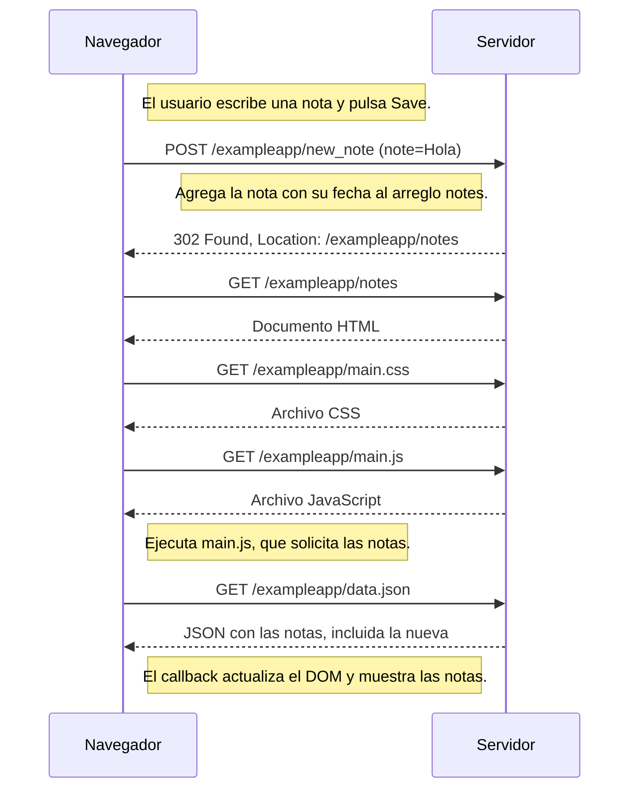

# Ejercicio 0.4: Nueva nota

Servidor: https://studies.cs.helsinki.fi. Las peticiones muestran solo las rutas.

```mermaid
sequenceDiagram
    participant browser as Navegador
    participant server as Servidor

    Note right of browser: El usuario escribe una nota y pulsa Save.
    browser->>server: POST /exampleapp/new_note (note=Hola)
    Note left of server: Agrega la nota con su fecha al arreglo notes.
    server-->>browser: 302 Found, Location: /exampleapp/notes

    browser->>server: GET /exampleapp/notes
    server-->>browser: Documento HTML

    browser->>server: GET /exampleapp/main.css
    server-->>browser: Archivo CSS

    browser->>server: GET /exampleapp/main.js
    server-->>browser: Archivo JavaScript

    Note right of browser: Ejecuta main.js, que solicita las notas.
    browser->>server: GET /exampleapp/data.json
    server-->>browser: JSON con las notas, incluida la nueva

    Note right of browser: El callback actualiza el DOM y muestra las notas.
```

