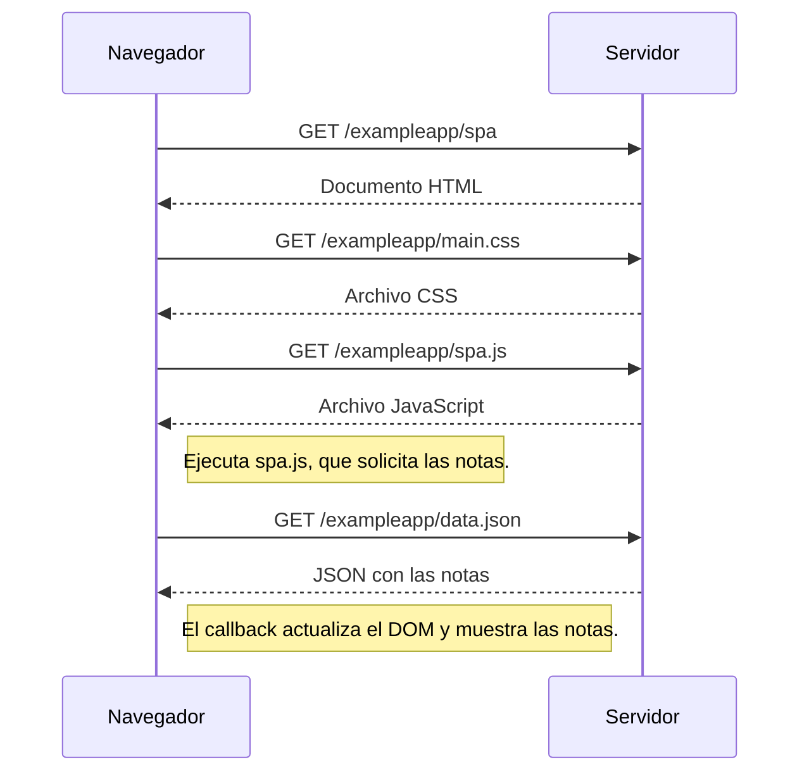

# Ejercicio 0.5: Carga de la SPA

Servidor: https://studies.cs.helsinki.fi. Las peticiones muestran solo las rutas.

```mermaid
sequenceDiagram
    participant browser as Navegador
    participant server as Servidor

    browser->>server: GET /exampleapp/spa
    server-->>browser: Documento HTML

    browser->>server: GET /exampleapp/main.css
    server-->>browser: Archivo CSS

    browser->>server: GET /exampleapp/spa.js
    server-->>browser: Archivo JavaScript

    Note right of browser: Ejecuta spa.js, que solicita las notas.
    browser->>server: GET /exampleapp/data.json
    server-->>browser: JSON con las notas

    Note right of browser: El callback actualiza el DOM y muestra las notas.
```

