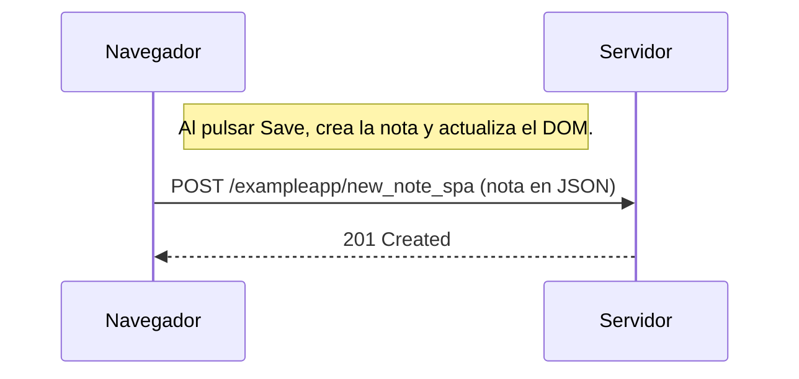

# Ejercicio 0.6: Nueva nota en la SPA

```mermaid
sequenceDiagram
    participant browser as Navegador
    participant server as Servidor

    Note right of browser: Al pulsar Save, crea la nota y actualiza el DOM.
    browser->>server: POST /exampleapp/new_note_spa (nota en JSON)
    server-->>browser: 201 Created
```

La actualización del DOM es una operación local del navegador y ocurre antes del POST. La página permanece abierta, sin recargarse.

